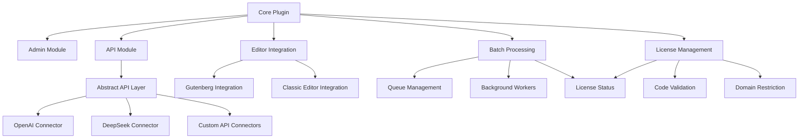

# System Patterns: WordPress Article Rewriter Plugin

## Architecture Overview

The plugin follows a modular architecture with clear separation of concerns:

## Design Patterns

### Factory Pattern
Used for creating API connector instances based on configuration:
- `APIFactory` class creates the appropriate connector
- Each connector implements a common interface
- Factory selects implementation based on user settings

### Strategy Pattern
Applied to rewriting strategies:
- Different rewriting styles implemented as strategies
- Common interface for all rewriting approaches
- Runtime selection based on user preferences

### Observer Pattern
Used for batch processing status updates:
- Jobs emit events during processing
- UI components observe these events
- Admin notifications subscribe to completion events

### Singleton Pattern
Applied to core plugin components:
- Main plugin class as singleton
- Settings manager as singleton
- License validator as singleton

## Data Flow

### Article Rewriting Process
1. Content is captured from editor
2. Preprocessing applies any necessary transformations
3. API request is formatted according to selected service
4. Request is sent to AI service
5. Response is processed and formatted
6. Rewritten content is returned to editor

### Batch Processing Flow
1. Articles are added to queue
2. Queue is persisted in database
3. Background process picks up queue items
4. Each item is processed through rewriting flow
5. Results are stored in database
6. Status updates are provided to user

### Licensing Flow
1. User enters purchase code
2. Code is validated against Envato API
3. Domain is registered with license
4. Regular checks verify license validity
5. Features are enabled/disabled based on license status

## Component Relationships

### Core and Modules
- Core provides service locator for module access
- Modules register themselves with core
- Core initializes modules in appropriate order
- Modules communicate through defined interfaces

### Editor Integrations
- Common rewriting service used by both editors
- Editor-specific UI components
- Shared configuration and processing logic

### API Connectors
- Abstract base class defines common interface
- Each connector handles service-specific requirements
- Connectors manage authentication and rate limiting
- Error handling standardized across connectors
